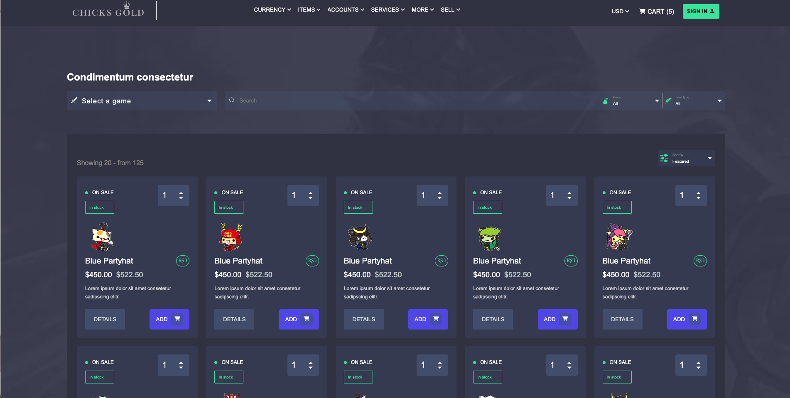
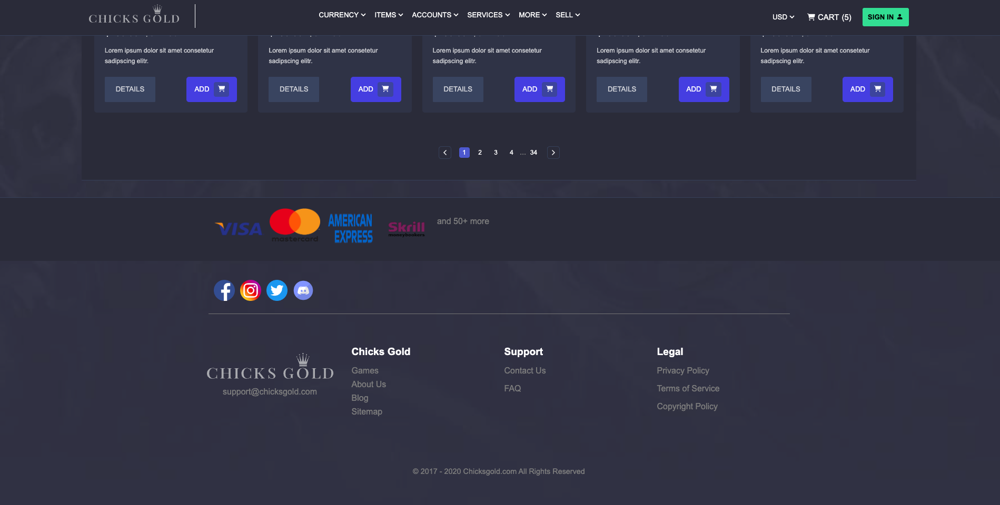
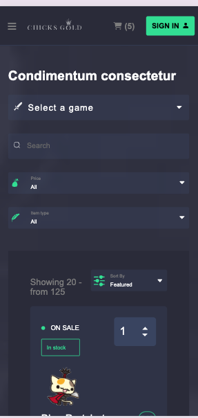
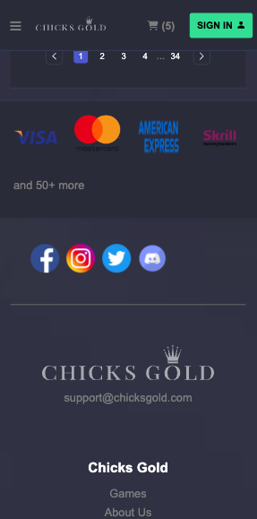

# Frontend Challenge

​

## Índice

​

- [FrontEndChallenge](#frontend-challenge)
  - [Instalación](#instalacion)
  - [Índice](#índice)
  - [1. Preámbulo](#1-preámbulo)
  - [2. Resumen del desarrollo del proyecto](#2-resumen-del-desarrollo-del-proyecto)
  - [4. Carpetas que encontrarás en el repositorio](#4-carpetas-que-encontrarás-en-el-repositorio)
  - [SRC](#src)
    - [App](#app)
    - [Components](#components)
    - [README](#readme)

​

# Instalación

```bash
git clone https://github.com/loregunner/front-challenge.git
```

## Instalar dependencias

```bash
yarn install  o npm install
```

```bash
yarn run dev  o npm run dev
```

## 1. Preámbulo

​
Este proyecto tiene como enfoque principal el realizar una maquetación de una pagina web de compras de items, se requeria trabajar con css puro, react y typescript, se realizo 500 items de juegos con paginación funcional.

## 2. Resumen del desarrollo del proyecto

Para la maquetación se trabajo con css puro, etiquetas html, react - vite, los iconos se traen de la libreria de react-icons, se creo un json de una carpeta de 500 imagenes con nodejs, tambien se despliega el proyecto pára ser visible en la web.

## 4. Framework - Librería - Lenguaje

|            | Descripción                                                                                                        |
| :--------- | :----------------------------------------------------------------------------------------------------------------- |
| ReactJS    | Es una librería de JavaScript                                                                                      |
| Vite       | Herramienta de construcción y desarrollo de aplicaciones                                                           |
| Typescript | TypeScript es un superconjunto de JavaScript que añade tipado estático opcional y funciones avanzadas a JavaScript |

## 5. Carpetas que encontrarás en el repositorio

## SRC

### App

| Archivo | Descripción                         |
| :------ | :---------------------------------- |
| App.tsx | Pagína inicial del proyecto         |
| App.css | Css global utilizado en el proyecto |


### README

​
| Archivo | Descripción |
| :-------- | :---------------------------- |
| readme.md | Documentación general del proyecto |

## 4. Look final del proyecto vista de ordenador

​

​

​

## 5. Look final del proyecto vista de móvil




